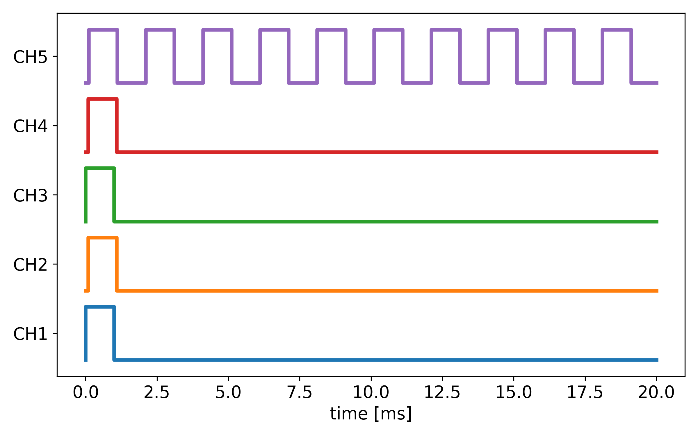
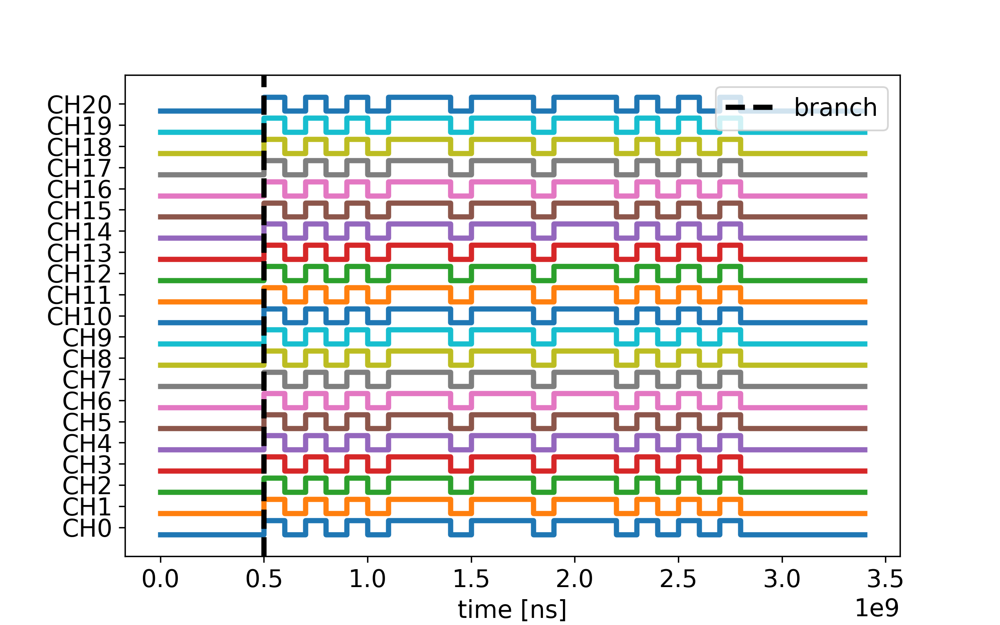

# PulseBlaster

Python interface for a Spincore PulseBlaster pulse generator.  
Only tested with the PulseBlaster ESR-PRO USB 250 MHz.


## Examples

### Generating a pulse sequence
With `generate_repeating_pulses` a series of repeating pulses can be generated composed of `Signal`.
Each `Signal` represents a pulse sequence with a frequency, offset and pulse high duration and channel(s). `generate_repeating_pulses` takes the frequency, offset and pulse high duration into account to find the minimum viable repeating sequence that corresponds to all the required signals.

`generate_repeating_pulses` also accepts `nr_channels` and `reserved_channels`.
Only channels in the range `0..(nr_channels - reserved_channels - 1)` are user-controllable.
For hardware with fully controllable outputs, set `reserved_channels=0`.

`masking_signals` act as periodic gating signals: their channels must be a subset of the
base `signals` channels, and they enable the associated base channels only during the
mask pulse high window.

```python
import matplotlib.pyplot as plt
from pulseblaster import Signal, generate_pulses, plot_sequence

# 50 Hz signal to be output on channels 1&3, which is high for 1 ms
flashlamp = Signal(
    frequency=50, offset=0, high=int(1e6), channels=[1, 3], active_high=True
)

# 50 Hz signal to be output on channels 2&4, which is offset by 90 us w.r.t to the 
# previous signal, high for 1 ms
qswitch = Signal(
    frequency=50,
    offset=int(90 * 1e3),
    high=int(1e6),
    channels=[2, 4],
    active_high=True,
)

# 500 Hz signal to be output on channel 5, offset by 110 us
other = Signal(
    frequency=500,
    offset=int(110 * 1e3),
    channels=[5],
    active_high=True,
)

# generate an infinitely repeating pulse sequence
sequence = generate_pulses.generate_repeating_pulses(
    [flashlamp, qswitch, other], masking_signals=None, progress=False
)

# plot the pulse sequence
plot_sequence(sequence)
plt.show()

```


### Programming
The code below shows how to program the PulseBlaster with a sequence and starts the sequence.

```python
from pulseblaster import PulseBlaster

# initialize the connection
pulse_gen = PulseBlaster(board_number = 0)

# program the sequence on the device
pulse_gen.program(sequence = sequence.instructions)

# start the sequence
pulse_gen.start()
```

### Reading PulseBlaster Interpreter code
PulseBlaster Interpreter code can be read, converted into a sequence of instructions and plotted: 
```Python
import matplotlib.pyplot as plt

from pulseblaster import code_to_instructions, plot_sequence

code = """// Sample program for SpinCore PulseBlaster Interpreter.
// SOS using loops.

// 3 Short
       0x000000, 500ms, CONTINUE
start: 0xFFFFFF, 100ms, LOOP, 3
       0x000000, 100ms, END_LOOP

// 3 Long
       0xFFFFFF, 300ms, LOOP, 3
       0x000000, 100ms, END_LOOP

// 3 Short
       0xFFFFFF, 100ms, LOOP, 3
       0x000000, 100ms, END_LOOP

// A pause
       0x000000, 500ms, branch, start // branch to start
"""

sequence = code_to_instructions(code)

# If your board uses a different instruction flag width:
# sequence = code_to_instructions(code, nr_flags=32)

plot_sequence(sequence)

plt.show()
```

